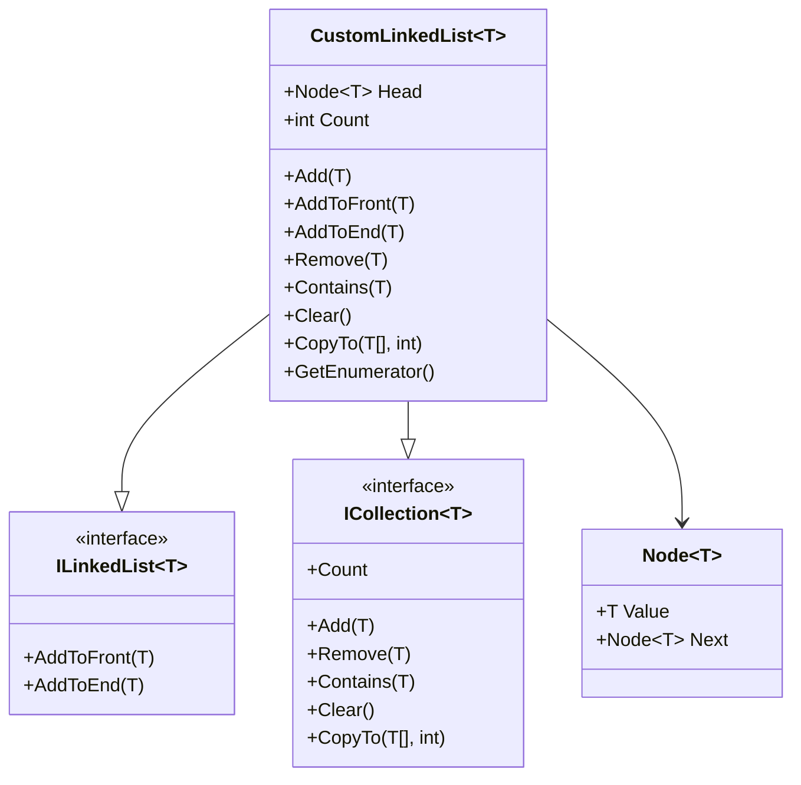

# 🚀 Custom Linked List in C#

<p align="center">
  
</p>

<p align="center">
  <b>A Fully Custom Generic Linked List Implementation in C#</b><br>
  Built from scratch with IEnumerator, ICollection, and Yield.
</p>

---

## 🎯 Project Goal

This project demonstrates how to build a **Generic Singly Linked List** from scratch in C#  
WITHOUT using `List<T>` or built-in collections.

It implements:

- `ICollection<T>`
- Custom `ILinkedList<T>`
- `IEnumerator<T>` using `yield return`
- Generic Node system

---


### Why?

Because we want the list to work with:

- string
- int
- double
- Custom classes
- Anything.

Without generics → we would need multiple versions of the same list.

With generics → one clean reusable implementation.

---

## 🔁 2️⃣ IEnumerable + yield return

Instead of writing a bulky Enumerator class manually, we used:

```csharp
yield return current.Value;
```

This automatically builds the Enumerator behind the scenes.

That allows this:

```csharp
foreach(var item in list)
```

Without writing 40+ lines of iterator logic.

Cleaner.
Smarter.
More readable.

---

## 📦 3️⃣ ICollection<T>

We implemented:

```csharp
public interface ILinkedList<T> : ICollection<T>
```

This forces us to implement:

- Add
- Remove
- Contains
- Clear
- CopyTo
- Count
- IsReadOnly

Why is this important?

Because now our list behaves like any real .NET collection.

Professional level structure.

---

## 🔗 4️⃣ Manual Node Linking

Instead of using List<T>, we manually created:

```csharp
public class Node<T>
```

Each node contains:

- Value
- Next pointer

So internally the list looks like:

```
[Head] → [Node] → [Node] → [Node] → null
```

This gives full control over:

- Memory structure
- Traversal logic
- Insert/remove behavior

---

# 📊 Class Diagram



---


# 🧱 Internal Structure Visualization

When items are added like this:

```csharp
myPlaylist.Add("Shape of You");
myPlaylist.AddToFront("Intro Song");
myPlaylist.AddToEnd("Believer");
```

Internally the memory becomes:

```
Head
 ↓
[Intro Song] → [Shape of You] → [Believer] → null
```

Each node points to the next one.

The last node always points to null.

---

# ⚙️ Methods Overview

---

## ➕ Add(T item)

Default behavior:

```csharp
AddToEnd(item);
```

Always inserts at the end.

Time Complexity: O(n)

---

## ➕ AddToFront(T item)

Steps:

1. Create new node
2. Point newNode.Next to current Head
3. Move Head to new node

```csharp
newNode.Next = Head;
Head = newNode;
```

Time Complexity: O(1)

Fastest operation in linked list.

---

## ➕ AddToEnd(T item)

Steps:

1. If Head is null → create first node
2. Otherwise traverse until last node
3. Attach new node

Time Complexity: O(n)

---

## 🔎 Contains(T item)

Traversal logic:

```csharp
while(current != null)
```

Compare each value.

Return true if found.

Time Complexity: O(n)

---

## ❌ Remove(T item)

Three scenarios:

1️⃣ Empty list → return false  
2️⃣ Removing Head → move Head to next  
3️⃣ Removing middle/last → bypass the node  

Core logic:

```csharp
current.Next = current.Next.Next;
```

Time Complexity: O(n)

---

## 🧹 Clear()

```csharp
Head = null;
Count = 0;
```

All nodes become unreachable → Garbage Collector removes them.

Time Complexity: O(1)

---

## 📦 CopyTo(T[] array, int index)

Copies list items to an existing array.

Starts copying from the given index.

Used to integrate with array-based systems.

---

## 🔁 GetEnumerator()

```csharp
while (current != null)
{
    yield return current.Value;
}
```

Enables:

```csharp
foreach(var item in list)
```

Without manually implementing IEnumerator class.

---

# 🖥️ Demo Explanation (Program.cs)

The demo simulates a music playlist.

Operations tested:

- Creating list
- Adding songs
- Searching songs
- Removing songs
- Copying to array
- Clearing the list
- Iterating with foreach

It also uses:

```csharp
Console.ForegroundColor
Console.ReadKey();
```

To simulate interactive output and better visualization.

---

# 📈 Time Complexity Summary

| Operation | Complexity |
|------------|------------|
| AddToFront | O(1) |
| AddToEnd | O(n) |
| Remove | O(n) |
| Contains | O(n) |
| Clear | O(1) |
| foreach | O(n) |

---

# 🚀 Possible Improvements

Future enhancements could include:

- Adding Tail pointer → make AddToEnd O(1)
- Converting to Doubly Linked List
- Adding Reverse() method
- Adding InsertAt(index)
- Implementing thread safety
- Making it immutable

---

# 🎓 What This Project Proves

✔️ Deep understanding of data structures  
✔️ Strong OOP design  
✔️ Knowledge of .NET collection contracts  
✔️ Ability to build core infrastructure manually  
✔️ Interview-ready level implementation  

---

# 👨‍🏫 Author

Dr. Youssef  
Custom Data Structures Implementation in C#

---

<p align="center">
  
</p>
