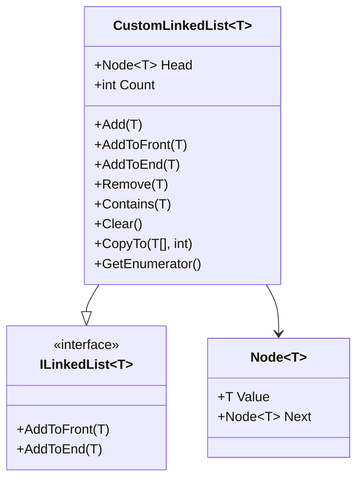

# 🚀 Custom Linked List in C#

<p align="center">
  
</p>

<p align="center">
  <b>A Fully Custom Generic Singly Linked List Implementation in C#</b><br>
  Built completely from scratch using Generics, ICollection, IEnumerable, and yield return.
</p>

---

# 🎯 Project Goal

This project demonstrates how to build a **Generic Singly Linked List**  
WITHOUT using `List<T>` or any built-in collection.

It manually implements:

- `ICollection<T>`
- Custom `ILinkedList<T>`
- `IEnumerator<T>` using `yield return`
- Custom `Node<T>` structure

---

# 🧠 Core Concepts Used

## ✅ Generics

```csharp
public class CustomLinkedList<T>
```

One implementation works with:

- string
- int
- double
- custom classes
- anything

Reusable. Clean. Scalable.

---

## ✅ IEnumerable + yield return

```csharp
yield return current.Value;
```

Allows:

```csharp
foreach(var item in list)
```

Without manually writing an Enumerator class.

---

## ✅ Manual Node Structure

```csharp
public class Node<T>
{
    public T Value { get; set; }
    public Node<T>? Next { get; set; }
}
```

Internal structure:

```
Head → Node → Node → Node → null
```

---

# 📊 Class Diagram



---

# ⚙️ Methods & Visual Demonstration

---

# ➕ AddToFront(T item)

### 🧠 What It Does

1. Create new node  
2. Point it to current Head  
3. Move Head to new node  

```csharp
newNode.Next = Head;
Head = newNode;
```

### ⏱ Complexity

O(1)

### 🎬 Animation

<p align="center">
  
</p>

---

# ➕ AddToEnd(T item)

### 🧠 What It Does

1. If list empty → create first node  
2. Traverse to last node  
3. Attach new node  

### ⏱ Complexity

O(n)

### 🎬 Animation

<p align="center">
  
</p>

---

# ❌ Remove(T item)

### 🧠 What It Does

Three cases:

1. Empty list → return false  
2. Removing Head → move Head  
3. Removing middle node → bypass it  

Core logic:

```csharp
current.Next = current.Next.Next;
```

### ⏱ Complexity

O(n)

### 🎬 Animation

<p align="center">
  
</p>

---

# 🔎 Contains(T item)

### 🧠 What It Does

Traverses node by node:

```csharp
while(current != null)
```

Returns true if match found.

### ⏱ Complexity

O(n)

---

# 🔁 GetEnumerator()

### 🧠 What It Does

Enables foreach traversal.

```csharp
while (current != null)
{
    yield return current.Value;
}
```

### ⏱ Complexity

O(n)

### 🎬 Traversal Animation

<p align="center">
  
</p>

---

# 🧹 Clear()

```csharp
Head = null;
Count = 0;
```

Garbage Collector removes nodes.

⏱ O(1)

---

# 📦 CopyTo(T[] array, int index)

Copies list values into array starting at index.

⏱ O(n)

---

# 📈 Time Complexity Summary

| Operation | Complexity |
|------------|------------|
| AddToFront | O(1) |
| AddToEnd | O(n) |
| Remove | O(n) |
| Contains | O(n) |
| Clear | O(1) |
| foreach | O(n) |

---

# 🚀 Future Improvements

- Add Tail pointer → O(1) AddToEnd
- Convert to Doubly Linked List
- Add Reverse()
- Add InsertAt(index)
- Add thread safety
- Make immutable version

---

# 🎓 What This Project Demonstrates

✔ Deep understanding of data structures  
✔ Strong OOP implementation  
✔ Knowledge of .NET collection contracts  
✔ Manual memory-style node linking  
✔ Clean enumerator implementation  

---

# 👨‍🏫 Author

Dr. Youssef  
Custom Data Structures Implementation in C#

---

<p align="center">
  
</p>
